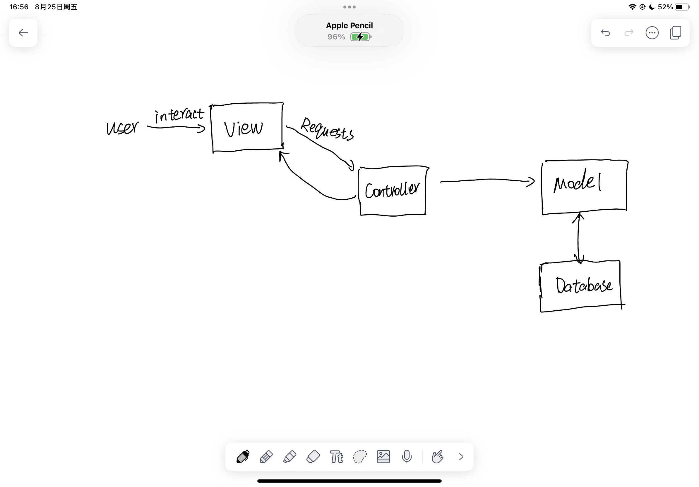

+++
draft = false
date = 2023-08-25
title = "IOS Development Cheat Sheet"
description = ""
tags = ["Swift","IOS development","MVC"]
+++

* [Design Pattern](#design_pattern)

## Design Pattern

IOS development uses MVC or MVVC design pattern.

1. Model
   The Model is responsible for the data and the business rules of the application. It communicates directly with the database or other data sources and provides data to the View. It's purely logic-based and doesn't contain any code related to the UI.
   ```swift
   struct Person {
        let name : String
        let age : Int
   }
   ```

2. View 
   The View is responsible for displaying the data provided by the Model. It doesn't process any data.

3. Controller
   The Controller acts as a mediator between the Model and the View. In IOS, this is often a `UIViewController`.The
   Controller listens to user input, processes it, updates the Model, and also updates the View to reflect any changes in the data

   ```swift
   class PersonViewController: UIViewController {
        var person: Person!
        @IBOutlet weak var personView: PersonView!

        override func viewDidLoad() {
            super.viewDidLoad()
            updateUI()
        }

        func updateUI() {
            personView.nameLabel.text = person.name
            personView.ageLabel.text = "\(person.age)"
        }
    }
   ```
4. MVC interaction
   

   Imagine you have a todo list app
   * View: Displays the list of tasks
   * User Interaction: User wants to delete one to-do
   * Controller: Receives this interaction and decides that the corresponding task needs to be removed
   * Model: The Controller then updates the View to no longer show the deleted task
   * Update View: Controller then updates the View
   * Now user cannot see the deleted task 